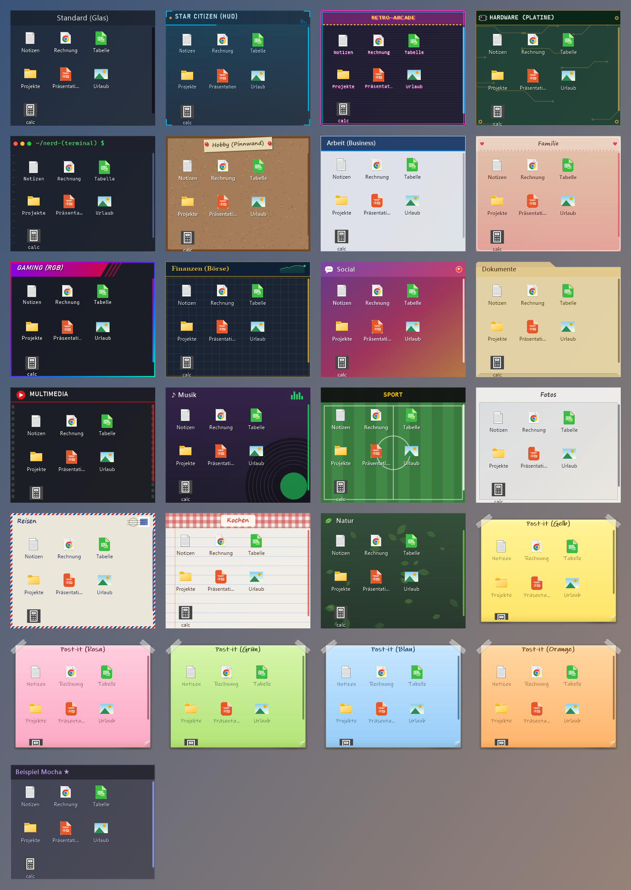
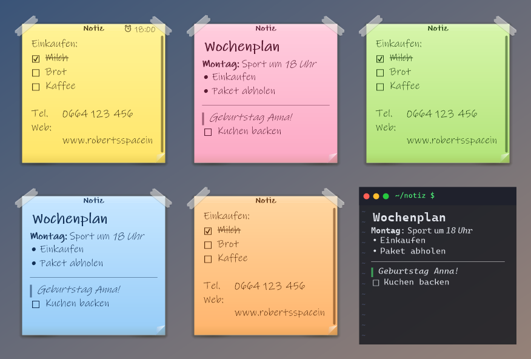
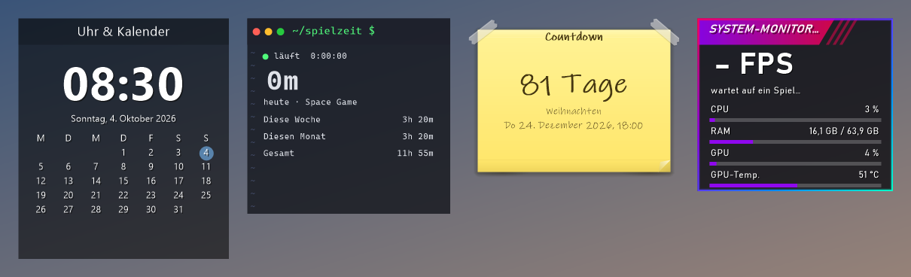
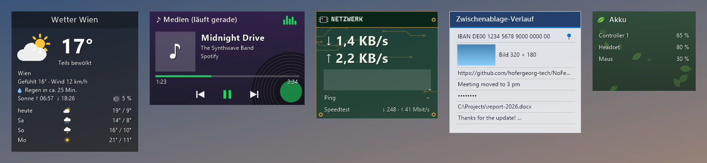
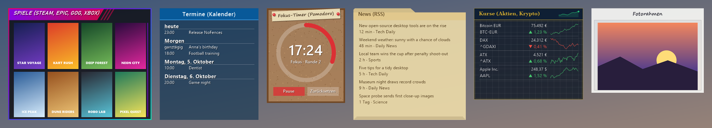
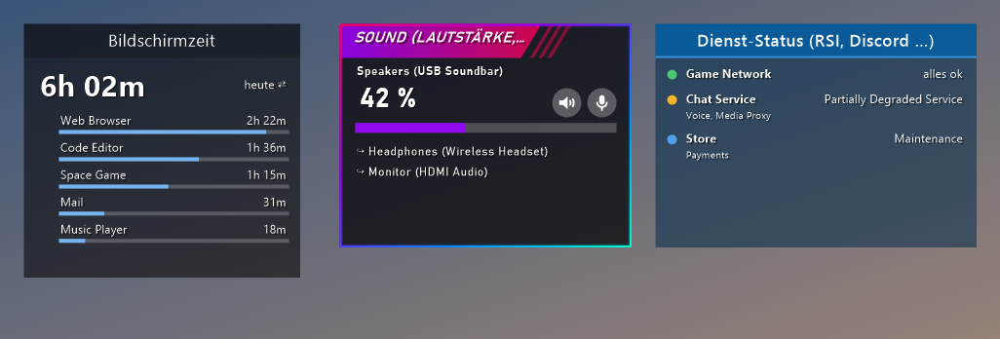
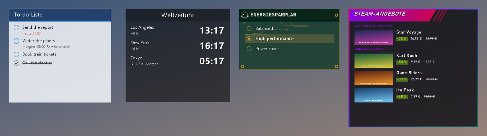

# NoFences

Free, open-source desktop fences for Windows 10/11 – plus sticky notes and widgets.
English · Deutsch · Italiano · Français · Español

> **This is a fork of [Twometer/NoFences](https://github.com/Twometer/NoFences)**, created by
> [Twometer](https://github.com/Twometer) and its contributors. All credit for the original idea and
> implementation goes to them. This fork ports the app to .NET 10 and adds the features listed below.
> See [Credits](#credits).



## Features

**Fences**
- **Link fences**: drag files/folders in from anywhere; they stay where they are.
- **Folder fences**: show the live contents of a folder; dropping files moves them in, so the icons really leave the desktop.
- **Auto-sort**: patterns like `*.pdf; *.docx` move new desktop files (and finished downloads) into a fence automatically.
- **Tabs**, **recent files**, an icons-only **quick-launch bar**, sorting (manual, name, type, date, size).
- Multi-select, keyboard (Enter, Delete, F2, Ctrl+A/C, arrows) and type-to-search.
- Snapping, positions per monitor setup, per virtual desktop, always on top, collapse to the title bar.
- Double-click empty desktop space to hide all fences; **Ctrl+Alt+D** brings them in front of all windows.

**Sticky notes** – free text, clickable `[ ]` checkboxes, links, reminders, a taped-on Post-it look in five colors.



**Widgets** – clock & calendar, system monitor (CPU, RAM, GPU, optional FPS), drives, recycle bin,
**playtime** of any game (pick its exe, NoFences records how long it runs), a **countdown**, **weather**
(Open-Meteo, no account), **now playing** with media controls, **network** rate and ping, **clipboard history** and
**battery**, your installed **games** (Steam with covers, Epic, GOG, Xbox), **appointments** from calendar links
(.ics), a **photo frame**, a **focus timer** (Pomodoro), **news** (RSS/Atom) and **prices** (stocks, crypto).





Also **screen time**, **sound** (volume, mute, switch playback device) and **service status** (RSI, Discord, Epic …):



**Search** – Ctrl+Alt+F searches everything in all fences (links, folder contents, tabs, notes), Start menu apps and
Windows settings, and calculates (`12*7`).

Plus a **to-do list** with due times and repetition, a **world clock**, **power plans** and **Steam sales**:



**Notes** understand simple formatting – `# headings`, `- bullets`, `> quotes`, `**bold**`, `*italic*` – and Ctrl+Alt+N
creates one from anywhere. Reminders can repeat.

**Tools** – a desktop assistant that sorts your desktop icons into fences, a screen ruler (px, cm, in), a color picker
and a Downloads clean-up (to the recycle bin).


**Profiles & automation** – group fences into profiles like "Work" and "Gaming"; switch by hand or automatically while
a program runs or at set times. Fences hide while something runs full screen, and the default style can follow
Windows' light/dark mode or the clock.

**Several PCs** – keep fences in a shared folder (e.g. OneDrive); positions stay per monitor setup.

**Styles** – 25 built-in styles (glass, Windows accent color, Star Citizen HUD, Retro-Arcade, Hardware, Nerd, Hobby,
Work, Family, Gaming, Finance, Social, Documents, Multimedia, Music, Sport, Photos, Travel, Cooking, Nature, Post-it ×5)
plus your own as JSON files; optional animations.

**App** – settings window, five languages (English, Deutsch, Italiano, Français, Español), built-in updates with one
click, export/import, automatic backups, help and changelog inside the app.

## Download

Get `NoFences.exe` from the [latest release](https://github.com/hofergeorg-tech/NoFences/releases/latest) – a single
file, no installation, no .NET needed. Windows may show a SmartScreen warning because the exe isn't code-signed yet:
"More info" → "Run anyway".

**Help:** [English](HELP.md) · [Deutsch](HILFE.md) · [Italiano](AIUTO.md) · [Français](AIDE.md) · [Español](AYUDA.md)
– also in the app (tray → Help).
**Changes:** [English](CHANGELOG.md) · [Deutsch](CHANGELOG.de.md) · [Italiano](CHANGELOG.it.md) ·
[Français](CHANGELOG.fr.md) · [Español](CHANGELOG.es.md)

**Online:** only what you set up – update checks (GitHub), weather (Open-Meteo), your calendar links, news feeds and
prices (Yahoo Finance; for information only).

## FPS measurement

Optional and off by default. Windows only provides frame-rate events (ETW) to processes with administrator rights,
so NoFences starts a small helper (`NoFences.exe --fps-helper`) elevated – the main app never runs as administrator.
The helper only counts presented frames per process and writes the frame rate of the program in front to a small file;
it reads no screen content and no input. Enabling it in the settings explains this and asks Windows once (UAC); a
Task Scheduler task then starts it without asking. Disabling removes the task.

## Build

Requires the [.NET 10 SDK](https://dotnet.microsoft.com/download).

```
dotnet build NoFences/NoFences.csproj -c Release
dotnet test NoFences.Tests/NoFences.Tests.csproj
```

- `.\publish.ps1` creates the self-contained single `dist\NoFences.exe`.
- `NoFences.exe --preview <folder>` renders all styles, notes, widgets and dialogs into PNGs (used for the images above).
- Pushing a tag like `v2.4.0` (must match `<Version>` in the csproj and have a changelog section) builds the exe, attaches
  a build-provenance attestation and creates the release with the changelog in three languages. Code signing via SignPath
  kicks in once `SIGNPATH_API_TOKEN` and `SIGNPATH_ORGANIZATION_ID` are set.
- winget: see [packaging/winget](packaging/winget/README.md).

## Configuration

Stored in `%LocalAppData%\NoFences\` (`fences.json`, `playtime.json`, `backups\`, `themes\`). Fences from NoFences 1.x are
migrated automatically. **Portable mode:** put an empty `portable.txt` next to `NoFences.exe`. With a shared folder
(Settings → Data & styles), the data lives there and `sync-folder.txt` in the local folder points to it.

## Credits

- **[Twometer](https://github.com/Twometer)**: original author of NoFences ([Twometer/NoFences](https://github.com/Twometer/NoFences)).
- Contributors to the original project: Birol Capa, damianb53, Daniel Lerch, GordnCZ, lucarnosky, QIVD, Tim.
- Shell context menu (`Win32/ShellContextMenu.cs`): Andreas Johansson, based on FileBrowser from CodeProject.
- Fork maintained by Georg Hofer – [www.georg-hofer.com](https://www.georg-hofer.com).

## Support

NoFences is free. If you like it, you can buy me a coffee:
[donate via PayPal](https://www.paypal.com/donate/?business=USLSACVSEY8YW&no_recurring=0&item_name=Coffee+donation&currency_code=EUR)
– also in the app under About and Settings → Updates. Thank you!

## License

MIT, see [LICENSE](LICENSE). The original copyright notice by Twometer is kept as required.
